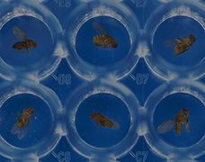

# How to install

### Step 1: Link required files:
```
<link href="css/jquery.zgallery.css" rel="stylesheet" type="text/css" />
<script src="js/jquery.min.js"></script>
<script src="js/jquery.touchSwipe.min.js"></script>
<script src="js/jquery.zgallery.js"></script>
```
### Step 2: Create HTML markup:
```
<ul class="thumbs clearfix">
    <li>
        <a data-zgallery="gallery1" data-src="#popup-1" href="javascript:;">
            
        </a>
    </li>
    <li>
        <a data-zgallery="gallery1" data-src="#popup-2" href="javascript:;">
            
        </a>
    </li>
    <li>
        <a data-zgallery="gallery1" data-src="#popup-3" href="javascript:;">
            
        </a>
    </li>
    <li>
        <a data-zgallery="gallery1" data-src="#popup-4" href="javascript:;">
            
        </a>
    </li>
    <li>
        <a data-zgallery="gallery1" data-src="#popup-5" href="javascript:;">
            
        </a>
    </li>
    <li>
        <a data-zgallery="gallery1" data-src="#popup-6" href="javascript:;">
            
        </a>
    </li>
    <li>
        <a data-zgallery="gallery1" data-src="#popup-7" href="javascript:;">
            
        </a>
    </li>
    <li>
        <a data-zgallery="gallery1" data-src="#popup-8" href="javascript:;">
            
        </a>
    </li>
</ul>
```

### Step 3: Call the plugin: 
```
$('body').zGallery();
```
